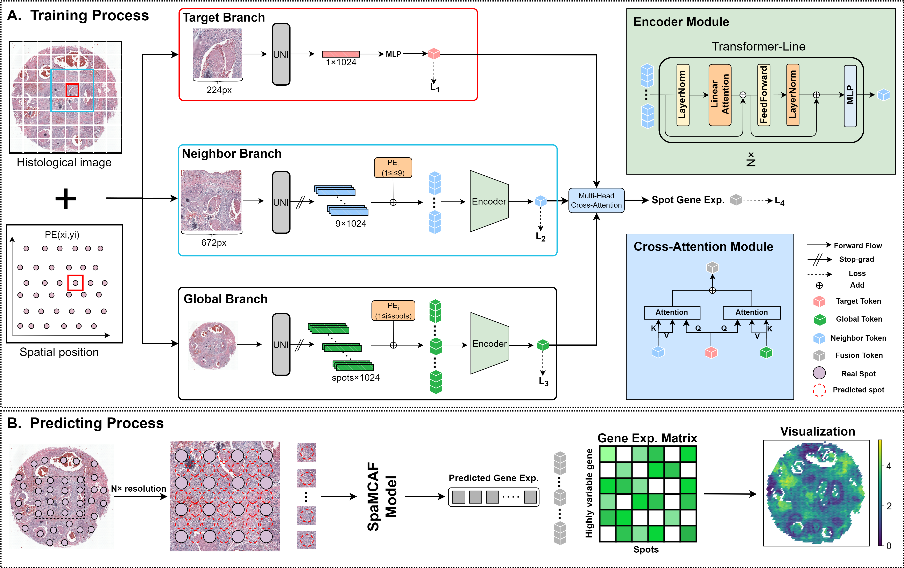

# SpaMCAF
## Introduction
Single-cell RNA sequencing (scRNA-seq) has transformed our understanding of individual cells within a population, but it lacks spatial information, limiting its ability to decipher cell interactions and spatial correlations in tissue structures. Spatial transcriptomics (ST) overcomes this by preserving the spatial localization of cells, offering detailed gene expression patterns, and demonstrating great potential in immunology, developmental biology, and oncology. However, ST technologies still struggle to balance spatial resolution and sequencing depth. Image-based methods offer single-cell spatial resolution but limited sequencing depth, while NGS-based methods can profile the entire transcriptome but have low spatial resolution. Existing deep learning-based methods also face challenges in achieving both high spatial resolution and sequencing depth. To address this, we developed SpaMCAF, a multimodal deep learning framework that enhances spatial gene expression by integrating multi-scale feature fusion and linear feature extraction using histological images and low-resolution ST data. SpaMCAF captures both macroscopic tissue structure and microscopic cellular patterns, outperforming existing methods in gene expression prediction and generating high-resolution gene expression maps.



## Requirements
All experiments were conducted on an NVIDIA RTX 3090 GPU. Before running SpaMCAF, you need to create a conda environment and install the required packages:
```shell
conda create -n HISTEX python==3.10.15
conda activate SpaMCAF
pip install -r requirements.txt
```

## Data
DLPFC dataset consists of 12 sections of the dorsolateral prefrontal cortex (DLPFC) sampled from three individuals. The number of spots for each section ranges from 3498 to 4789. The original authors have manually annotated the areas of the DLPFC layers and white matter. The datasets are available in the spatialLIBD package from [http://spatial.libd.org/spatialLIBD](http://spatial.libd.org/spatialLIBD).

MouseBrain dataset includes a coronal brain section sample from an adult mouse, with 2903 sampled spots. The datasets are available in [https://cf.10xgenomics.com/samples/spatial-exp/1.1.0/V1_Adult_Mouse_Brain/V1_Adult_Mouse_Brain_web_summary.html](https://cf.10xgenomics.com/samples/spatial-exp/1.1.0/V1_Adult_Mouse_Brain/V1_Adult_Mouse_Brain_web_summary.html).

Human Breast Cancer1 (BC1) dataset includes a fresh frozen invasive ductal carcinoma breast tissue section sample, with 3813 sampled spots. The datasets are available in [https://www.10xgenomics.com/datasets/human-breast-cancer-block-a-section-1-1-standard-1-0-0](https://www.10xgenomics.com/datasets/human-breast-cancer-block-a-section-1-1-standard-1-0-0).

Human Breast Cancer2 (BC2) dataset includes a formalin-fixed invasive breast carcinoma tissue section sample, with 2518 sampled spots. The datasets are available in [https://www.10xgenomics.com/datasets/human-breast-cancer-ductal-carcinoma-in-situ-invasive-carcinoma-ffpe-1-standard-1-3-0](https://www.10xgenomics.com/datasets/human-breast-cancer-ductal-carcinoma-in-situ-invasive-carcinoma-ffpe-1-standard-1-3-0)


## Pre-trained general-purpose foundation mode
Given the outstanding performance of large pre-trained general-purpose foundation models in clinical tasks, we use UNI as the backbone feature extractor. Before using SpaMCAF, you need to apply to UNI for permission to access the model weights: [https://huggingface.co/mahmoodlab/UNI](https://huggingface.co/mahmoodlab/UNI).

## SpaMCAF pipeline
- Install the UNI module form [https://github.com/mahmoodlab/UNI](https://github.com/mahmoodlab/UNI).
- Run train.py
- Run test.py

## Contact details
If you have any questions, please contact 1833726826@qq.com and wenwen.min@qq.com.
